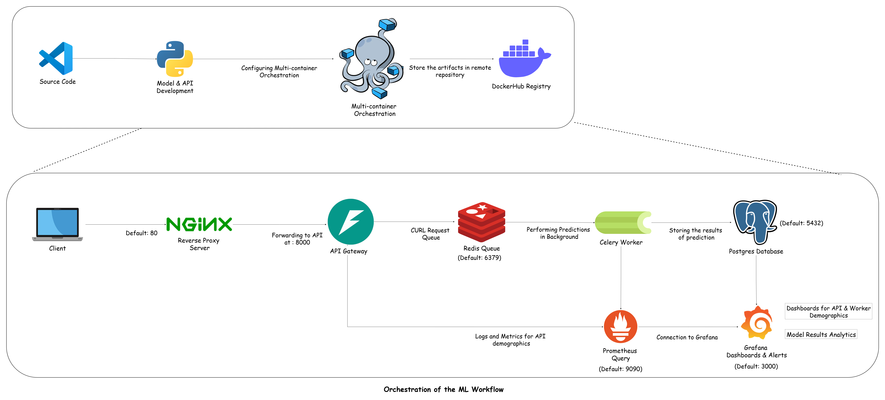
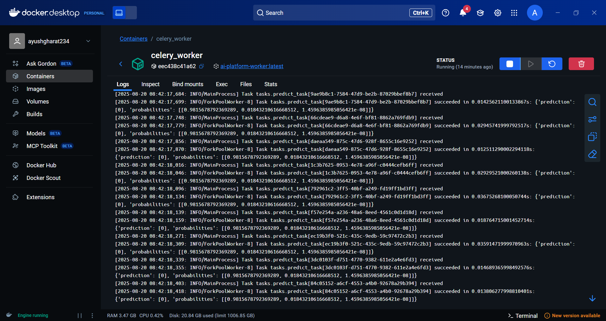
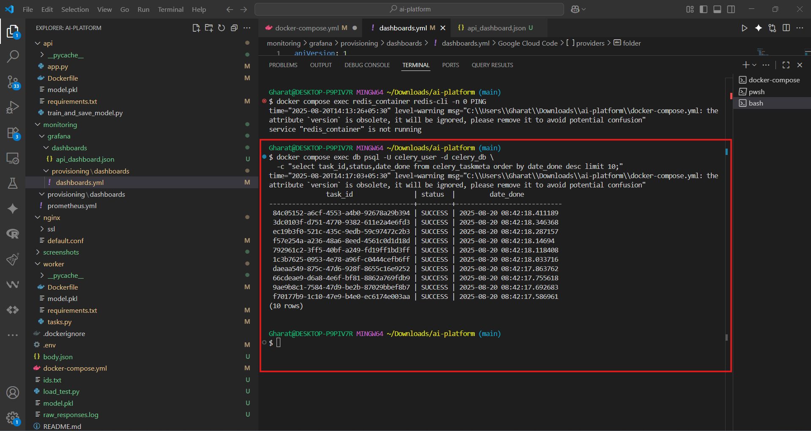
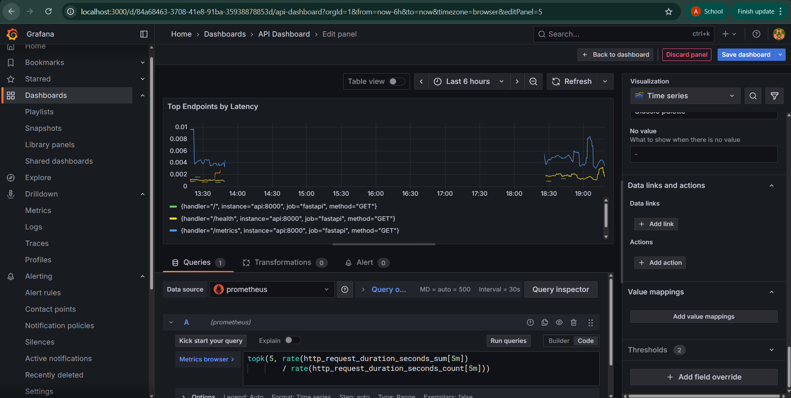

# AI Platform: Scalable ML Inference with Monitoring & Analytics

[](https://fastapi.tiangolo.com/) [](https://docs.celeryq.dev/en/stable/) [](https://redis.io/) [](https://www.postgresql.org/) [](https://www.nginx.com/) [](https://prometheus.io/) [](https://grafana.com/) [](https://www.docker.com/) 

---

## Architecture Diagram



---

## Project Overview

This project demonstrates a **production-grade AI inference platform** built with modern DevOps & MLOps tools.  
It integrates:  

- **FastAPI** → API Gateway for ML requests  
- **Celery** → Asynchronous task execution  
- **Redis** → Broker for distributed workers  
- **Postgres** → Persistent storage of results for analytics  
- **Prometheus & Grafana** → Monitoring and alerting  
- **Nginx** → Reverse proxy for production-like routing  

---

## Project Structure

```
├── api/ # FastAPI service  
│ ├── app.py  
│ ├── model.pkl  
│ ├── train_and_save_model.py  
│ └── requirements.txt  
│  
├── worker/ # Celery worker  
│ ├── tasks.py  
│ ├── model.pkl  
│ └── requirements.txt  
│  
├── nginx/ # Reverse proxy  
│ └── default.conf  
│  
├── monitoring/ # Prometheus & Grafana configs  
│ ├── prometheus.yml  
│ └── grafana/  
│ ├── dashboards/  
│ │ └── api_dashboard.json  
│ └── provisioning/  
│ └── dashboards.yml  
│  
├── docker-compose.yml # Multi-service stack  
├── .env # Environment variables  
├── screenshots/ # Visual workflow proofs  
├── load_test.py # Script for multiple requests  
├── README.md # Documentation (this file)  
```

---

## Architecture Workflow

1. **Client Request** → Send input via FastAPI (`/predict`).  
2. **Celery Task** → Request sent to Redis → Worker picks it up.  
3. **ML Model** → Iris classifier runs inference.  
4. **Results Stored** → Postgres DB saves results for later analytics.  
5. **Monitoring** → Prometheus scrapes metrics, Grafana visualizes them.  
6. **Logs** → Redis, Worker, API logs all visible for debugging.  
7. **Reverse Proxy** → Requests pass through Nginx.  

---

## Visual Showcase

### 1️⃣ Submitting a Prediction Request
*Shows a `curl` command sending data to the `/predict` endpoint and receiving a task ID.*


### 2️⃣ Celery Worker Processing the Task
*Demonstrates the worker logs as it picks up and executes the inference task.*


### 3️⃣ Querying Stored Results in PostgreSQL
*A `psql` query showing the prediction result saved in the `predictions` table.*


### 4️⃣ Visualizing Performance in Grafana
*The Grafana dashboard displaying key metrics like request latency and throughput.*


---

## Getting Started

### 1. Clone Repo
```bash
git clone https://github.com/your-username/ai-platform.git
cd ai-platform
```

### 2. Build & Start All Containers
```bash
docker-compose up --build
```

API Testing  

### Single Request
```bash
curl -X POST http://localhost:8000/predict/ \
  -H "Content-Type: application/json" \
  -d '{"features": [5.1, 3.5, 1.4, 0.2]}'
```
Output:
```json
{"task_id":"c2815e23-445e-4c18-992c-a2e30468446d","status":"Task submitted"}
```

### Multiple Requests (Load Test)
```bash
python load_test.py
```

### Query Task Result
```bash
curl http://localhost:8000/results/c2815e23-445e-4c18-992c-a2e30468446d
```

---

## Postgres Integration

### Connect to Database
```bash
docker exec -it postgres psql -U celery_user -d celery_db
```

### Query Predictions
```sql
SELECT * FROM predictions;
```

---

## Monitoring & Observability

### Prometheus Metrics 
- [http://localhost:9090](http://localhost:9090)  

### Grafana Dashboards
- [http://localhost:3000](http://localhost:3000)  

---

## Full Command Reference

```bash
# Bring up services
docker-compose up --build

# Health-check API
curl http://localhost:8000/health

# Send prediction request
curl -X POST http://localhost:8000/predict/ -H "Content-Type: application/json" -d '{"features": [5.1, 3.5, 1.4, 0.2]}'

# Query results
curl http://localhost:8000/results/{task_id}

# Logs
docker logs -f api_container
docker logs -f celery_worker
docker logs -f redis_container
docker logs -f postgres

# Connect Postgres
docker exec -it postgres psql -U celery_user -d celery_db

# Query stored results
SELECT * FROM predictions;

# Access monitoring
http://localhost:9090    # Prometheus
http://localhost:3000    # Grafana
http://localhost:8000    # API
```

---

## Key Features

- Asynchronous Inference (Celery + Redis)  
- Persistent Results (Postgres)  
- Monitoring & Alerts (Prometheus + Grafana)  
- Reverse Proxy (Nginx)  
- Logs for Debugging (API, Worker, Redis, Postgres)  
- Extensible ML Backend (plug & play models)  

---

## Future Improvements

-  Model versioning & experiment tracking (MLflow / DVC)  
-  Authentication & RBAC for secure APIs  
-  Advanced monitoring (latency histograms, error rate alerts)  
- Kubernetes migration with Helm charts  
- Horizontal auto-scaling of workers  

---

## Conclusion

This project showcases an end-to-end AI platform integrating ML inference, async task processing, persistent analytics, monitoring, and observability.  

It serves as a blueprint for production ML systems and demonstrates strong engineering practices in containerization, DevOps, and MLOps.  